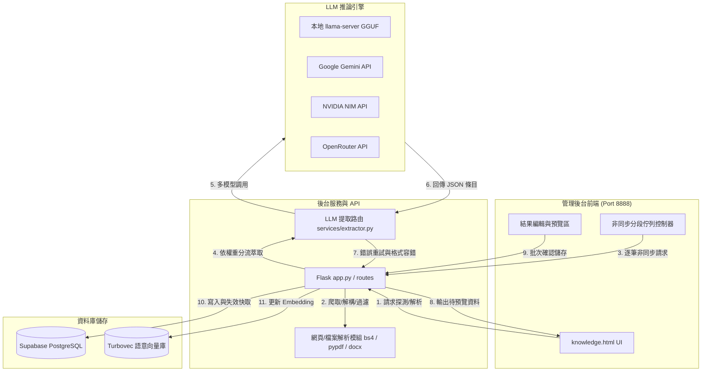
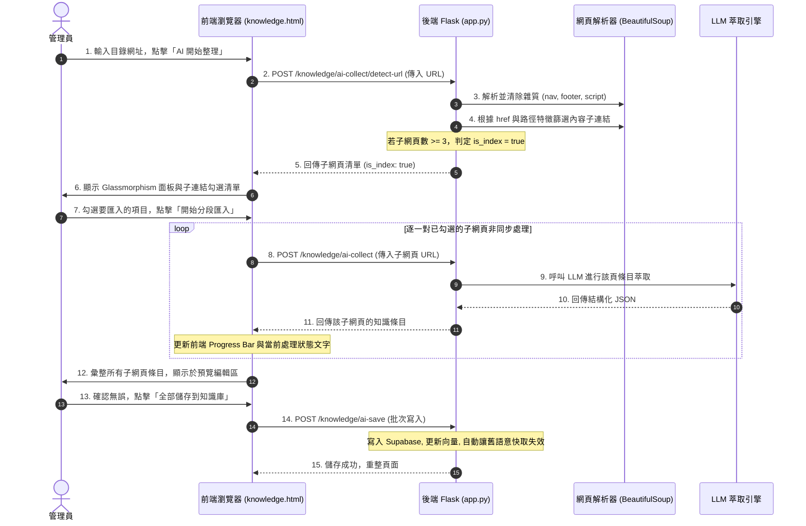

# 🤖 LINE Bot 智慧客服後台：AI 知識條目蒐集匯整系統架構與操作手冊

本文件詳盡說明 LINE Bot 客服與智慧後台系統中，針對「資料蒐集匯整與知識條目自動產生」的四大功能之系統架構設計與管理員操作手冊。本系統基於檢索增強生成（RAG）與本地/雲端多模型分流技術，幫助管理員快速將雜亂網頁、文件與文稿，轉化為標準的 LINE Bot 回答知識庫。

---

## 1. 系統架構設計 (System Architecture)

本系統的資料蒐集與條目產生模組（簡稱 **AI-Collect**）採用前端非同步控制佇列、後端 Flask API 解析分流、以及多模型 API 路由的混合式架構。

### 1.1 全域微服務與資料流



---

### 1.2 核心技術細節與防禦性設計

#### A. 多模型分流與指數退避重試 (Exponential Backoff Retry)
後端 `_llm_extract` 模組支援四種 LLM 供應商（`local`、`gemini`、`nvidia`、`openrouter`）。由於外部 API 存在極限速率限制（Rate Limit）或偶發性連線逾時，系統設計了自動重試機制：
- **嘗試次數**：最大重試 4 次。
- **延遲退避**：初始延遲 2.0 秒，後續重試以 $1.5^n$ 指數型遞增（例如 2.0s $\rightarrow$ 3.0s $\rightarrow$ 4.5s）。
- **錯誤過濾**：自動識別客戶端錯誤（如 `400 Bad Request`, `401 Unauthorized`），此類錯誤不進行重試，直接中斷以節省運算資源。

#### B. 超強容錯 JSON-Markdown 混合解析器 (`_fallback_extract`)
大語言模型有時會無法嚴格遵守 `JSON` 輸出格式（例如夾帶 Markdown 標記、包含未逸出的雙引號，或是回傳註解）。當 `json.loads` 失敗時，系統會自動切換至 **Fallback 解析器**：
1. **正規表示式解析**：使用 `re.findall(r'\{([^{}]+)\}')` 提取 JSON-like 物件區塊，寬鬆匹配 `title`、`content` 與 `tags`。
2. **Markdown 解析**：若依然失敗，則自動解析常見的 Markdown 條列格式（如 `1.`、`-` 或 `###`），並以 `標題:`、`內容:` 等關鍵字為標記，強制萃取出結構化欄位。

#### C. 子網頁目錄結構探測與前端非同步進度條分段匯入
當面臨包含大量子項目的目錄頁面時，直接一次性爬取所有內容會因字數過多或 LLM 處理過久，造成 `504 Gateway Timeout`。
為此，系統導入了 **時序分段佇列機制**：



---

### 1.3 資料庫 Schema 設計 (`Supabase PostgreSQL`)

本系統的知識管理核心圍繞在以下幾個主要資料表，並實作多租戶資料隔離政策（RLS）：

#### 1. 知識庫資料表 (`knowledge_base`)
儲存 AI 萃取並經過管理員確認的條目。

| 欄位名稱 | 資料類型 | 預設值 | 說明 |
| :--- | :--- | :--- | :--- |
| `id` | `uuid` | `gen_random_uuid()` | 主鍵 (Primary Key) |
| `company_id` | `uuid` | (外鍵，必填) | 關聯 `companies.id`，支援多租戶隔離 |
| `title` | `text` | (必填) | 條目標題 (建議 10 字以內，利於 Flex 按鈕呈現) |
| `content` | `text` | (必填) | 詳細解答內容 (100-300 字) |
| `tags` | `text[]` | `NULL` | 分類標籤陣列 |
| `embedding` | `vector(3072)` | `NULL` | 3072 維度向量 (用於語意檢索) |
| `metadata` | `jsonb` | `NULL` | 包含 `summary`、`target`、`action_text` 等 AI 輔助資訊 |
| `is_active` | `boolean` | `true` | 是否啟用該條目 |

#### 2. 語意快取資料表 (`semantic_cache`)
為了降低 LLM 運算開銷並達到毫秒級回覆，LINE Bot 在回答前會先檢索語意快取。當後台**新增、修改或刪除** `knowledge_base` 時，會觸發 `_invalidate_cache_for_text` 讓關聯的舊快取自動失效。

| 欄位名稱 | 資料類型 | 說明 |
| :--- | :--- | :--- |
| `id` | `bigint` | 主鍵，對應 Turbovec 向量庫索引 ID |
| `company_id` | `uuid` | 關聯 `companies.id` |
| `query_text` | `text` | 用戶提問的原始文字 |
| `reply_data` | `text` | 對應的 LINE Flex JSON 或純文字回答內容 |
| `is_active` | `boolean` | 是否啟用 (失效時設為 `false`) |

---

### 1.4 知識檢索匹配機制 (RAG & Hybrid Search)

當 LINE Bot 收到用戶訊息時，系統採用了雙重檢索機制以確保高召回率與精準度：

1. **語意快取檢索 (Semantic Cache Match)**：
   - 系統計算輸入文字的向量，快速比對 `semantic_cache` 中相似度高於臨界值的歷史答覆，若命中則直接秒回。
2. **混合式知識檢索 (Hybrid Knowledge Match)**：
   - 若快取未命中，系統會調用 Supabase RPC 函數 `match_knowledge_hybrid`，結合 **N-Gram 模糊字元匹配**（利用 PostgreSQL tsvector 全文檢索）與 **3072維向量餘弦相似度比對 (Cosine Similarity)**，最後加權計算排序，回傳前 5 筆最相關的知識條目給 LLM 做 RAG 合成回答。

> [!IMPORTANT]
> **快取自動失效機制 (Invalidation Rule)**
> 當管理員在後台執行「手動新增知識」、「AI 萃取儲存」或「刪除知識條目」時，系統會立即透過 `invalidate_semantic_cache_by_text` 掃描並停用（`is_active = false`）所有在語意上與該異動內容相關的歷史快取，確保 LINE Bot 用戶不會讀到過時的快取答覆。

---

### 1.5 AI 萃取核心 Prompt 範本與欄位規範

為了讓 LLM（無論是本地 GGUF 或外部高階 API）能夠穩定輸出符合 Supabase Schema 與 LINE Bot 圖卡互動格式的資料，系統在 [extractor.py](file:///home/pipadmin/文件/admin/services/extractor.py) 中定義了高結構化的 Prompt 範本：

#### 📝 動態 Prompt 範本內容
```text
你是知識庫整理助手。請從以下文字中萃取出所有重要且清晰的知識條目（如果是商品、服務或 FAQ 介紹，請將每款商品或每個問答獨立建立一條條目，總數在 2-8 個之間）。
{重點提示：<管理員輸入的補充提示詞>}

【原始文字】
<抓取或上傳的原始文字內容，最大截斷至 16,000 字>

【極重要指令】
請直接且僅回傳 JSON 陣列，直接以 [ 開頭並以 ] 結尾。格式如下：
[
  {
    "title": "條目標題（10字以內）",
    "content": "詳細說明內容（100-300字）",
    "tags": ["標籤1", "標籤2"],
    "summary": "針對此條目的一句話簡短摘要（60字以內，繁體中文，不可含 Markdown）",
    "target": "適用對象/目標受眾，例如「一般消費者」、「企業用戶」、「VIP 會員」，無特定對象則設為空字串",
    "action_text": "引導按鈕點擊後自動發送的文字，例如「我想了解方案價格」，無合適寫法則設為空字串"
  },
  ...
]

【注意事項】
1. 嚴禁在 JSON 的字串值內部使用未逸出的雙引號。若字串值內有雙引號，必須寫成 \"。
2. 請直接輸出 JSON 陣列，不要加入任何解釋文字或 Markdown 外殼包裝。
```

#### ⚙️ Prompt 設計巧思與欄位用途說明
- **動態提示插值 (`{重點提示}`)**：如果管理員在後台填寫了「補充提示詞 (Hint)」，該內容會以最高權重動態插入 Prompt，用於強迫 AI 過濾掉無關細節（如：*忽略營業時間，只擷取補貼金額*）。
- **`title` 與 `action_text` 的字數與聯動限制**：
  - `title` 被嚴格限制在 **10 字以內**。這是因為 LINE Flex Message 的按鈕與卡片標題若字數過長，在手機螢幕上會被截斷或排版崩壞。
  - `action_text` 規範為點擊後自動發送的簡短問句，這可做為 RAG 第二層引導對話的觸發語句。
- **嚴格的轉義防禦**：
  - 由於 LLM 輸出的文字中常含有雙引號，容易造成後續 JSON 解析損毀，Prompt 在注意事項第 1 點特別警告 LLM 進行 `\"` 轉義。同時，後端接收到文字後，亦會使用 `escape_json_newlines` 進行二次格式清洗，確保 `json.loads` 順利執行。

---

## 2. 後台管理員操作手冊 (Admin User Manual)

「AI 資料蒐集」面板採用一站式 NotebookLM 風格設計。管理員可以在後台透過 **Tab 標籤** 切換四種不同的原始資料來源，將資料交給 AI 整理，並在同一介面中預覽、修訂，最後批次匯入知識庫。

### 📌 共通配置：補充提示詞 (Hint) 與 整理結果預覽
不論使用哪一種萃取模式，您都可以善用下方的 **「補充提示詞」** 欄位：
- **使用場景**：如果您只想擷取特定資訊（如：*「只要關於退款和保固的資訊」* 或 *「忽略地址電話，只擷取申辦資格與補貼金額」*），請在此欄位輸入提示，AI 會嚴格遵循您的過濾條件。
- **預覽與二次編輯**：AI 整理完成後，會於下方渲染出 **「AI 整理結果（可編輯）」** 區塊。您可以直接修改條目的「標題」、「詳細內容」及「標籤」，確認完美後再點擊 **「全部儲存到知識庫」**。

---

### 2.1 功能一：網址/網頁爬取萃取 (URL Mode)

適用於直接抓取政府官網、企業產品頁、部落格公告等網頁資料。

#### 💡 操作步驟 (一般單頁網址)：
1. 切換至 **「🔗 網址匯入」** 標籤。
2. 在 **網址 URL** 輸入框中貼上目標網頁的完整網址。
3. 可選：在下方輸入「補充提示詞」（例如：*請以條列式整理申請資格*）。
4. 點擊 **「✨ AI 開始整理」**，系統將在背景爬取文字並進行結構化，完成後會彈出預覽結果。

#### 🚀 亮點功能：子網頁目錄結構探測與分段匯入（防止超時與漏字）
當您輸入的網址屬於「目錄頁面/列表頁面」（例如產品服務總覽頁面，包含多個子服務項目）時：
1. 系統會自動探測並觸發 **「子網頁結構探測」**，在下方彈出一個半透明的 **「偵測到目錄網頁！」** 玻璃面板。
2. 面板中會列出所有偵測到的子項目標題（如：「方案收費介紹」、「企業客製化導入流程」等）與勾選框。
3. 您可以利用「全選」或自行勾選想要匯入的特定子項目。
4. 點擊 **「🚀 開始分段批次匯入」**。
5. 此時，前端將啟動非同步佇列控制，進度條會隨著處理進度動態前進，並顯示 `🔄 正在處理 (3/10): 企業客製化導入流程 ...`。這能徹底解決單次抓取過大網頁導致的網關逾時（504 Gateway Timeout）問題。
6. 全數完成後，所有子網頁萃取的知識條目將合併呈現在下方預覽區，您可以一次性檢查並存檔。

---

### 2.2 功能二：檔案上傳萃取 (File Mode)

適用於手邊有現成的 PDF 簡報、Word 規章、Markdown 文件或 TXT 備忘錄，想要直接將其轉化為知識庫條目。

#### 💡 操作步驟：
1. 切換至 **「📂 檔案上傳」** 標籤.
2. 點擊上傳框，選擇您電腦中的檔案。系統目前支援的檔案格式包含：`.txt`、`.md`、`.pdf`、`.docx`。
3. 填寫可選的「補充提示詞」。
4. 點擊 **「✨ AI 開始整理」**。後端將讀取檔案、進行文字提取，並呼叫 AI 將長篇大論的檔案內容切分為 2-8 筆清晰的問答或條目。

> [!TIP]
> **檔案解析限制**
> 為了避免單次上傳超大型文件造成本地顯示卡顯存溢出或 API Token 爆量，系統設有防禦性安全閥：
> - **PDF 檔案**：僅解析並讀取前 **10 頁** 的文字內容。
> - **Word (.docx) 檔案**：僅讀取前 **100 個段落** 的文字內容。
> - 建議上傳前，先將大型手冊切分為較小的主題式檔案，再進行分批上傳。

---

### 2.3 功能三：線上主題搜尋萃取 (Search Mode)

當您的知識庫需要補充外部通用知識，而您手邊又沒有現成網頁或檔案時，這項功能是最佳幫手。

#### 💡 操作步驟：
1. 切換至 **「🔍 主題搜尋」** 標籤。
2. 在 **搜尋主題** 輸入框中，鍵入您想尋找的業務主題關鍵字（例如：*「火鍋肉片建議熟度與涮法」*）。
3. 點擊 **「✨ AI 開始整理」**。
4. 系統會在背景安全地呼叫 DuckDuckGo 進行網頁檢索，撈取排名前 3 筆的網頁標題與內容摘要，將這些外部參考資訊彙整後，交給 AI 進行客觀整理，最終產出 2-3 筆精準的知識條目。

---

### 2.4 功能四：純文字/文稿直接萃取 (Text Mode)

適用於主管隨手寫下的草稿、客服人員整理的零散 FAQ 文字，或是直接從 Line 聊天對話中複製出來的雜亂問答。

#### 💡 操作步驟：
1. 切換至 **「📋 貼入文字」** 標籤。
2. 將任何不規則、無結構的純文字拷貝，並直接貼入大文字框中。
3. 在下方「補充提示詞」中，您可以輸入一些結構化的命令（例如：*「請幫我整理成一問一答的 FAQ 格式，並移除語助詞」*）。
4. 點擊 **「✨ AI 開始整理」**。AI 會去除廢話與不必要的口語字詞，將文字重新結構化、潤飾，產出整齊易讀的知識庫條目。

---

### 2.5 💡 進階知識庫 Metadata 的 LINE Bot 聯動效應

在編輯 AI 整理結果時，您會看到有些欄位與前台 LINE Bot 的呈現效果有著直接的關聯：
1. **適用對象 (Target)**：描述此知識條目主要針對的客群（如：*滿65歲以上長者*）。LINE Bot 在進行 RAG 合成回答時，會參考此欄位以進行更精準的對話客群分類。
2. **簡短摘要 (Summary)**：用於後台快速瀏覽與 LINE Bot 內部對話上下文的快速參考。
3. **引導按鈕點擊發送文字 (Action Text)**：**極為重要！** 當本條目被 LINE Bot 檢索並決定以 **Flex Message (輪播圖卡或 Silent Card)** 的形式傳送給用戶時，卡片下方的**引導按鈕**將會以此欄位文字作為按鈕標題。用戶點擊該按鈕後，會自動在 LINE 對話框中發送這段文字，形成順暢的引導式對話體驗。
